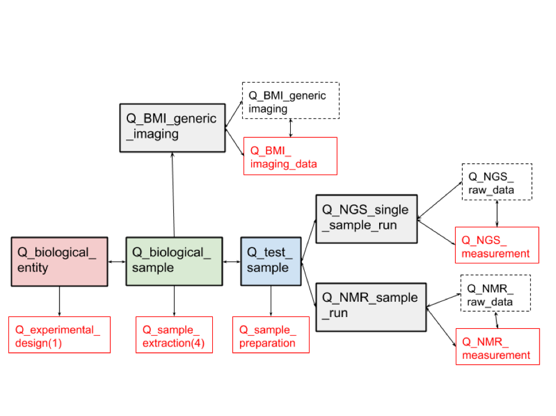

# Metadata schema

QBiC's OpenBIS metadata model schema.

## General overview

The metadata entitites in OpenBIS are classified between Samples, Experiments and Data sets. Here is a general overview of the relationship between them. Samples are Highlighted in color, experiments are highlighted in red, and data sets are marked with discontinuous lines. These relationships are modular, and can vary from project to project.

<p align="center">
    <a href="./docs/images/general_scheme.png"></a>
</p>

For each sample, experiment, or dataset type, there is a set of metadata properties allowed.
The set of sample, experiment, and dataset types with their attached properties defines the metadata schema.
The properties can consist of controlled vocabularies, which are also defined as part of the schema.

## Schema

Contains json schema extracted from OpenBIS for:

- [sample types](schema/sample_types.json)
- [experiment types](schema/experiment_types.json)
- [dataset types](schema/dataset_types.json)
- [vocabularies](schema/vocabularies.json)

### Schema - extracting script

[This](SchemaToJson.groovy) script extracts the current metadata model as stored in OpenBIS. Usage:

```bash
groovy SchemaToJson.groovy credentials.json
```

## metadata-sheets-schema

Schema defining the metadata sheets for partner labs and their relationship to the OpenBIS metadata.
